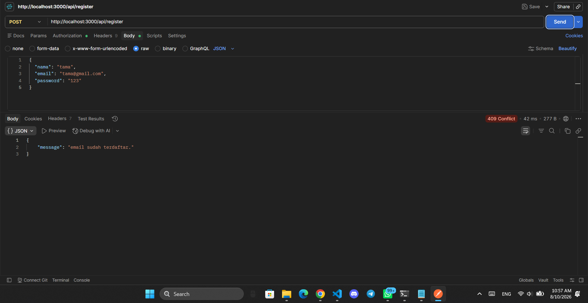
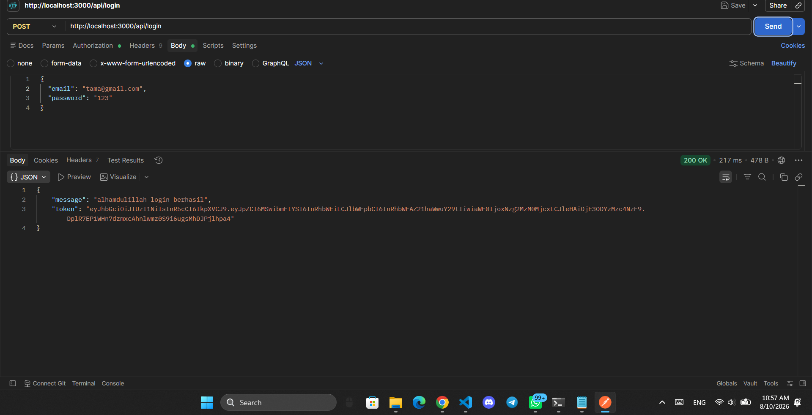
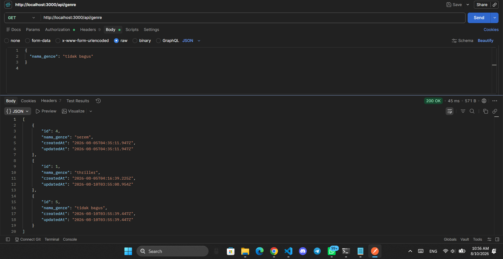
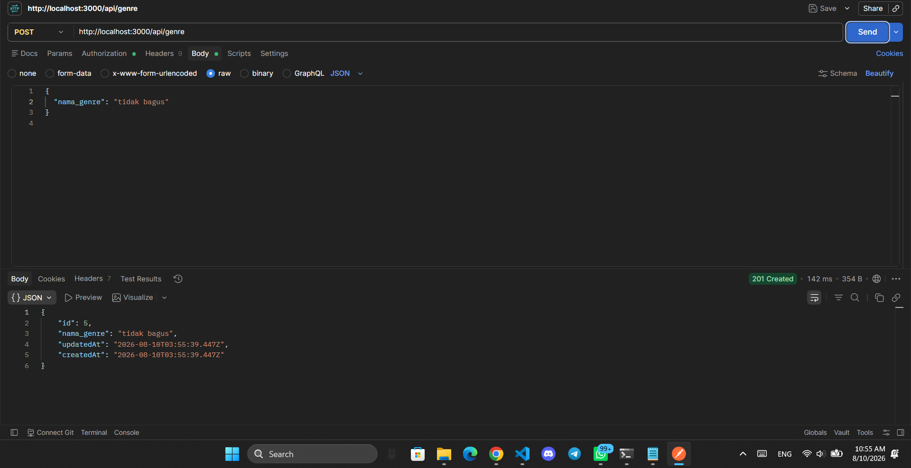
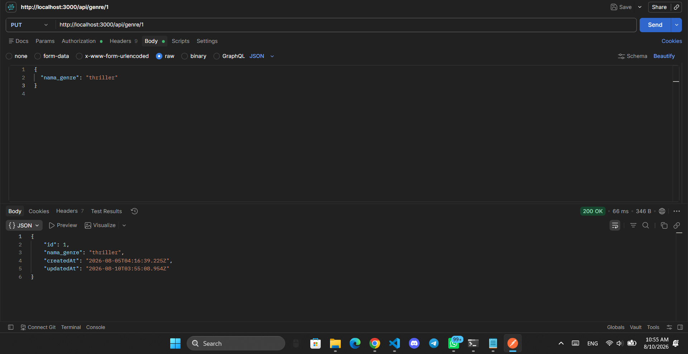
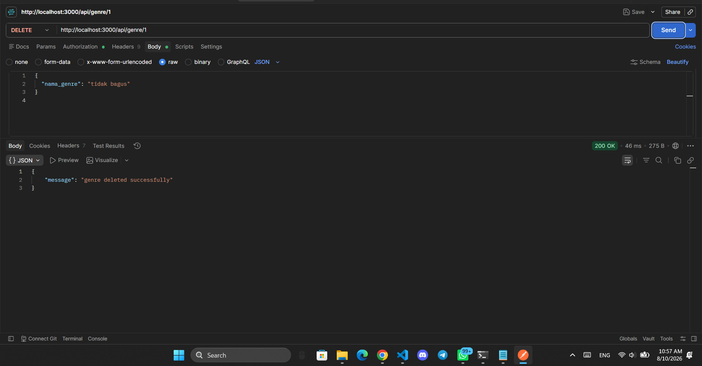
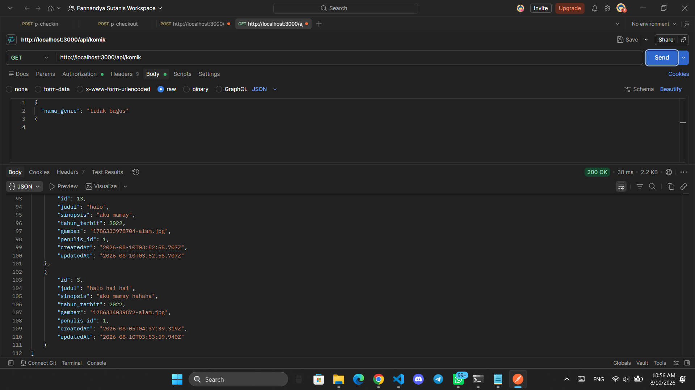
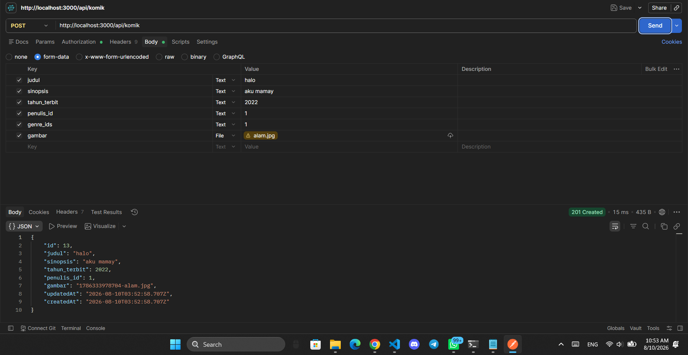
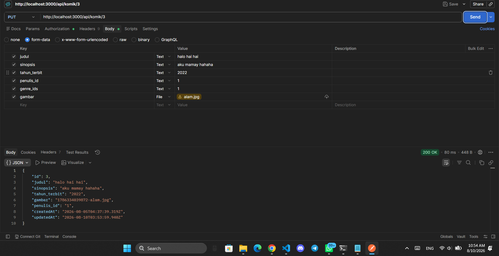
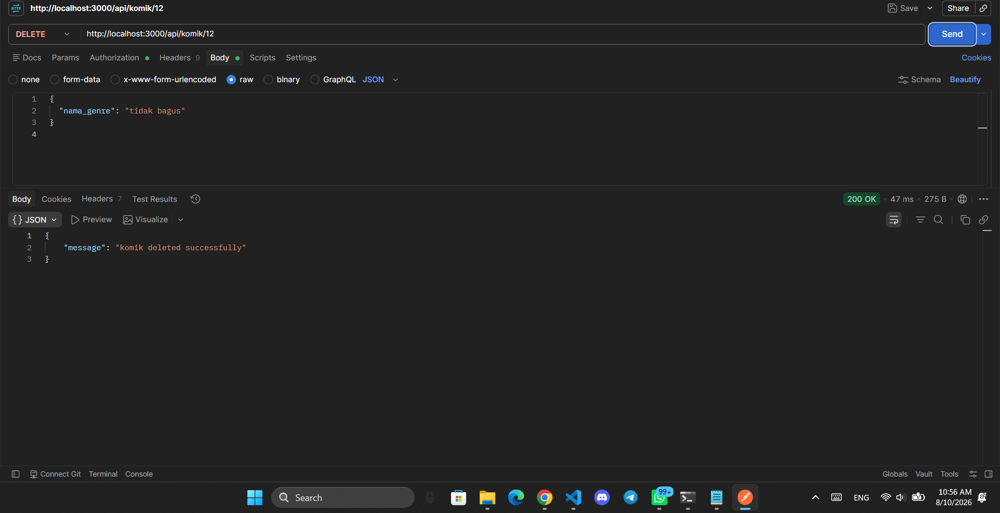

<div align="center">

# 📚 API Pengelolaan Komik

### RESTful API untuk Mengelola Data Komik, Genre, dan Penulis


**Repositori:** [https://github.com/rrassya19-bit/157_APIFile](https://github.com/rrassya19-bit/157_APIFile.git)

</div>

---

## 📖 Daftar Isi

1. [Pendahuluan](#-pendahuluan)
2. [Fitur Aplikasi](#-fitur-aplikasi)
3. [Teknologi yang Digunakan](#-teknologi-yang-digunakan)
4. [Struktur Folder Proyek](#-struktur-folder-proyek)
5. [Alur Pembuatan Proyek dari Nol](#-alur-pembuatan-proyek-dari-nol)
6. [Persiapan & Instalasi](#-persiapan--instalasi)
7. [Dokumentasi Kode Per File](#-dokumentasi-kode-per-file)
8. [Desain Database & Relasi](#-desain-database--relasi)
9. [Dokumentasi Endpoint API + Screenshot](#-dokumentasi-endpoint-api--screenshot)
10. [Panduan Penggunaan di Postman](#-panduan-penggunaan-di-postman)
11. [Daftar Kode Status HTTP](#-daftar-kode-status-http)
12. [Keamanan & Tips](#-keamanan--tips)
13. [FAQ / Troubleshooting](#-faq--troubleshooting)
14. [Lisensi & Identitas](#-lisensi--identitas)

---

## 🚀 Pendahuluan

Proyek **API Pengelolaan Komik** adalah sebuah **RESTful API** yang dibangun menggunakan **Node.js**, **Express.js**, **Sequelize ORM**, dan **PostgreSQL**. API ini digunakan untuk mengelola data komik beserta relasinya dengan **penulis (penulis)** dan **genre (genre)**.

Fitur utamanya:

- ✅ Autentikasi pengguna (registrasi & login) menggunakan **JWT (JSON Web Token)** dan **bcrypt**.
- ✅ Setiap endpoint CRUD dilindungi oleh **middleware autentikasi** (token wajib dikirim).
- ✅ CRUD data **Genre** dan **Komik**.
- ✅ **Upload gambar** komik menggunakan **Multer** (hanya `JPG`, `JPEG`, `PNG`, maksimal **5 MB**).
- ✅ Relasi database: **Penulis 1 ⟶ N Komik** dan **Komik N ⟷ M Genre**.
- ✅ Seluruh pesan respons dalam **Bahasa Indonesia** sehingga mudah dipahami.

**Base URL:**

```
http://localhost:3000/api
```

Semua request ke API memerlukan header **`Authorization: Bearer <token>`** kecuali endpoint **register** dan **login**.

---

## ✨ Fitur Aplikasi

| No | Fitur | Keterangan |
|----|-------|------------|
| 1 | **Registrasi Penulis** | Mendaftarkan penulis baru dengan password yang di-hash menggunakan bcrypt (salt rounds = 10). |
| 2 | **Login Penulis** | Memverifikasi email & password, lalu menghasilkan token JWT yang berlaku sesuai `JWT_EXPIRES_IN`. |
| 3 | **Autentikasi JWT** | Semua endpoint data (genre & komik) mengecek token `Bearer` pada header. |
| 4 | **CRUD Genre** | Tambah, lihat, ubah, dan hapus data genre. |
| 5 | **CRUD Komik** | Tambah, lihat, ubah, dan hapus data komik beserta gambar sampulnya. |
| 6 | **Upload Gambar** | Upload gambar sampul komik via `multipart/form-data` menggunakan Multer. |
| 7 | **Relasi Database** | Komik terhubung ke penulis (belongsTo) dan genre (belongsToMany). |
| 8 | **Validasi Input** | Pengecekan kolom wajib, duplikat email/nama genre, dan penggunaan relasi sebelum penghapusan. |
| 9 | **Pesan Error Jelas** | Semua pesan error dalam Bahasa Indonesia. |
| 10 | **Sinkronisasi Tabel** | Tabel dibuat/diubah otomatis melalui `sequelize.sync({ alter: true })`. |

---

## 🛠️ Teknologi yang Digunakan

Teknologi dan library berikut digunakan dalam proyek ini (versi sesuai `package.json`):

| Teknologi | Versi | Fungsi |
|-----------|-------|--------|
| **Node.js** | ≥ 18 | Runtime JavaScript di sisi server. |
| **Express** | 5.2.1 | Framework web untuk membuat server dan routing. |
| **Sequelize** | 6.37.8 | ORM (Object Relational Mapping) untuk PostgreSQL. |
| **pg** | 8.22.0 | Driver PostgreSQL untuk Node.js. |
| **bcrypt** | 6.0.0 | Hashing password (enkripsi satu arah) dan perbandingan password. |
| **jsonwebtoken** | 9.0.3 | Membuat dan memverifikasi token JWT. |
| **multer** | 2.2.0 | Middleware untuk upload file (gambar komik). |
| **dotenv** | 17.4.2 | Membaca variabel lingkungan dari file `.env`. |
| **nodemon** | 3.1.14 | Auto-restart server saat ada perubahan kode (mode development). |
| **sequelize-cli** | 6.6.5 | Command line tool untuk Sequelize (migrasi/seeder). |

---

## 📂 Struktur Folder Proyek

```
157_APIFile/
├── 📁 config/
│   ├── config.js           # Konfigurasi koneksi database (dari .env)
│   └── db.js               # Koneksi & sinkronisasi database
├── 📁 controller/
│   ├── penulisController.js  # Logika register & login
│   ├── genreController.js    # Logika CRUD genre
│   └── komikController.js    # Logika CRUD komik + upload gambar
├── 📁 middleware/
│   ├── authMiddleware.js     # Verifikasi token JWT
│   └── uploadMiddleware.js   # Konfigurasi Multer (upload gambar)
├── 📁 models/
│   ├── index.js              # Auto-load semua model & relasi
│   ├── penulis.js            # Model tabel penulis
│   ├── komik.js              # Model tabel komik
│   └── genre.js              # Model tabel genre
├── 📁 routes/
│   └── api.js                # Definisi semua endpoint API
├── 📁 ss/                    # Folder berisi screenshot hasil pengujian API
├── 📁 uploads/               # Folder tempat penyimpanan gambar hasil upload
├── .env                      # Variabel lingkungan (TIDAK di-commit ke git)
├── .sequelizerc              # Konfigurasi path Sequelize CLI
├── .gitignore                # Daftar file/folder yang diabaikan git
├── index.js                  # Entry point server (file utama)
├── package.json              # Metadata proyek & dependencies
└── package-lock.json         # Kunci versi dependency
```

### Penjelasan Fungsi Setiap Folder / File

| Folder / File | Fungsi |
|---------------|--------|
| `config/config.js` | Mendefinisikan konfigurasi koneksi database berdasarkan variabel `.env`. |
| `config/db.js` | Membuka koneksi ke database dan menjalankan sinkronisasi model. |
| `controller/` | Berisi logika bisnis aplikasi (fungsi yang menangani setiap request). |
| `middleware/` | Berisi fungsi perantara yang berjalan sebelum controller (auth & upload). |
| `models/` | Berisi definisi tabel database dan relasi antar tabel. |
| `routes/api.js` | Memetakan URL endpoint ke fungsi controller yang sesuai. |
| `ss/` | Menyimpan screenshot hasil pengujian setiap endpoint di Postman. |
| `uploads/` | Tempat file gambar yang di-upload disimpan. |
| `index.js` | Titik awal server: membuat app Express, mount route, dan listen port. |

---

## 🧭 Alur Pembuatan Proyek dari Nol

Berikut urutan logis bagaimana proyek ini dibangun dari awal hingga siap digunakan:

### Langkah 1 — Inisialisasi Proyek
```bash
npm init -y
npm install express sequelize pg bcrypt jsonwebtoken multer dotenv
npm install -D nodemon sequelize-cli
```

### Langkah 2 — Membuat Struktur Folder
Buat folder sesuai kebutuhan proyek:

```bash
mkdir config controller middleware models routes uploads ss
```

### Langkah 3 — Menyiapkan Konfigurasi
- Buat file `.env` berisi kredensial database dan kunci JWT.
- Buat `config/config.js` untuk membaca `.env`.
- Buat `config/db.js` untuk koneksi dan sinkronisasi database.

### Langkah 4 — Membuat Model (Definisi Tabel)
Buat urutan model berdasarkan relasi:
1. `models/penulis.js` (tabel utama pertama)
2. `models/genre.js` (tabel utama kedua)
3. `models/komik.js` (tabel yang bergantung pada penulis & genre)
4. `models/index.js` (memuat semua model otomatis)

### Langkah 5 — Membuat Middleware
1. `middleware/authMiddleware.js` — proteksi token JWT.
2. `middleware/uploadMiddleware.js` — upload gambar dengan Multer.

### Langkah 6 — Membuat Controller
1. `controller/penulisController.js` — registrasi & login.
2. `controller/genreController.js` — CRUD genre.
3. `controller/komikController.js` — CRUD komik + upload gambar + relasi.

### Langkah 7 — Membuat Routes
`routes/api.js` — menghubungkan URL dengan controller + middleware.

### Langkah 8 — Membuat Entry Point
`index.js` — memulai server Express dan terhubung ke database.

### Langkah 9 — Menjalankan Server
```bash
npm start
```

### Langkah 10 — Menguji API
Gunakan **Postman** / **Thunder Client** untuk menguji semua endpoint (lihat bagian [Panduan Postman](#-panduan-penggunaan-di-postman)).

---

## ⚙️ Persiapan & Instalasi

### Prasyarat

Pastikan perangkat Anda sudah memiliki:

- ✅ **Node.js** versi **18 atau lebih baru** — [unduh di sini](https://nodejs.org)
- ✅ **PostgreSQL** — [unduh di sini](https://www.postgresql.org/download/)
- ✅ **Postman** atau **Thunder Client** (VS Code extension) untuk menguji API

### Langkah 1 — Clone Repositori

```bash
git clone https://github.com/rrassya19-bit/157_APIFile.git
cd 157_APIFile
```

> Jika tidak menggunakan Git, cukup unduh/copy folder proyek ini.

### Langkah 2 — Install Dependencies

```bash
npm install
```

Perintah ini akan menginstal semua dependency yang tertera di `package.json` ke dalam folder `node_modules`.

### Langkah 3 — Membuat Database di PostgreSQL

Buka **pgAdmin** atau terminal `psql`, lalu buat database baru. Contoh melalui `psql`:

```sql
CREATE DATABASE perpustakaan;
```

> Nama database ini harus **sama persis** dengan nilai `DB_DATABASE` pada file `.env`.

### Langkah 4 — Membuat File `.env`

Buat file baru bernama `.env` di **root folder proyek** dengan isi (contoh template):

```env
DB_USER=postgres
DB_PASS=password_anda_disini
DB_DATABASE=perpustakaan
DB_HOST=127.0.0.1
DB_PORT=5432
DB_DIALECT=postgres

JWT_SECRET=ganti_dengan_kunci_rahasia_anda
JWT_EXPIRES_IN=1d
```

Penjelasan setiap variabel:

| Variabel | Keterangan |
|----------|------------|
| `DB_USER` | Username PostgreSQL (default: `postgres`). |
| `DB_PASS` | Password user PostgreSQL. |
| `DB_DATABASE` | Nama database yang sudah dibuat. |
| `DB_HOST` | Alamat host database (lokal: `127.0.0.1`). |
| `DB_PORT` | Port PostgreSQL (default: `5432`). |
| `DB_DIALECT` | Jenis database (harus `postgres`). |
| `JWT_SECRET` | Kunci rahasia untuk menandatangani token JWT. |
| `JWT_EXPIRES_IN` | Masa berlaku token, contoh: `1d` = 1 hari, `2h` = 2 jam, `60m` = 60 menit. |

> ⚠️ **PENTING:** File `.env` berisi kredensial sensitif dan sudah masuk daftar `.gitignore`, sehingga **tidak akan di-commit** ke repositori Git.

### Langkah 5 — Menjalankan Server

```bash
npm start
```

Jika berhasil, terminal akan menampilkan log seperti berikut:

```
Database connected successfully
Database synchronized
Server is running on http://localhost:3000
```

Artinya:

- ✅ Database berhasil terhubung.
- ✅ Tabel dibuat/sinkronisasi otomatis oleh Sequelize.
- ✅ Server siap menerima request di `http://localhost:3000`.

---

## 📝 Dokumentasi Kode Per File

Bagian ini menjelaskan **seluruh isi kode** proyek beserta fungsinya, file per file.

---

### 1. `package.json`

File ini berisi metadata proyek dan daftar dependency yang dibutuhkan.

```json
{
  "name": "157_api_relasi",
  "version": "1.0.0",
  "description": "",
  "main": "index.js",
  "scripts": {
    "start": "nodemon index.js",
    "test": "echo \"Error: no test specified\" && exit 1"
  },
  "keywords": [],
  "author": "",
  "license": "ISC",
  "type": "commonjs",
  "dependencies": {
    "bcrypt": "^6.0.0",
    "dotenv": "^17.4.2",
    "express": "^5.2.1",
    "jsonwebtoken": "^9.0.3",
    "multer": "^2.2.0",
    "nodemon": "^3.1.14",
    "pg": "^8.22.0",
    "sequelize": "^6.37.8",
    "sequelize-cli": "^6.6.5"
  }
}
```

**Penjelasan:**

| Bagian | Keterangan |
|--------|------------|
| `name` | Nama paket proyek. |
| `main` | File utama yang dijalankan, yaitu `index.js`. |
| `scripts.start` | Perintah `npm start` → menjalankan `nodemon index.js` (server otomatis restart saat kode berubah). |
| `type` | `commonjs` → menggunakan sintaks `require()` / `module.exports`. |
| `dependencies` | Library yang dibutuhkan saat aplikasi berjalan. |

---

### 2. `config/config.js`

File ini membaca file `.env` dan mengekspor konfigurasi database untuk lingkungan **development**.

```js
require('dotenv').config();

const development = {
    username: process.env.DB_USER,
    password: process.env.DB_PASS,
    database: process.env.DB_DATABASE,
    host: process.env.DB_HOST,
    port: process.env.DB_PORT,
    dialect: process.env.DB_DIALECT
};

module.exports = { development };
```

**Penjelasan:**
- `require('dotenv').config()` → memuat semua variabel dari file `.env` ke `process.env`.
- Setiap properti (username, password, database, host, port, dialect) diambil dari variabel lingkungan.
- Konfigurasi dipakai oleh Sequelize (baik lewat `models/index.js` maupun Sequelize CLI).

---

### 3. `config/db.js`

File ini berfungsi untuk membuka koneksi ke database dan menyinkronkan model.

```js
const db = require ('../models');

async function connectDatabase() {
    try {
        await db.sequelize.authenticate();
        console.log('Database connected successfully');

        await db.sequelize.sync({ alter: true });
        console.log('Database synchronized');

    } catch (error) {
        console.error('Database connection failed:', error.message);
        process.exit(1);
    }
}

module.exports = connectDatabase;
```

**Penjelasan:**
- `db.sequelize.authenticate()` → menguji apakah koneksi ke database berhasil.
- `db.sequelize.sync({ alter: true })` → membuat tabel jika belum ada, dan menyesuaikan kolom jika model berubah (tanpa menghapus data).
- Jika gagal, log error ditampilkan dan proses dihentikan (`process.exit(1)`).

---

### 4. `models/penulis.js`

Model tabel **penulis**. Penulis adalah pengguna API (yang mendaftar & login), sekaligus pembuat komik.

```js
module.exports = (sequelize, DataTypes) => {
    const Penulis = sequelize.define('Penulis', {
        id: {
            type: DataTypes.INTEGER,
            primaryKey: true,
            autoIncrement: true
        },
        nama: {
            type: DataTypes.STRING,
            allowNull: false
        },
        email: {
            type: DataTypes.STRING,
            allowNull: false,
            unique: true
        },
        password: {
            type: DataTypes.STRING,
            allowNull: false
        }
    }, {
        tableName: "penulis",
        timestamps: true
    });

    Penulis.associate = (models) => {
        Penulis.hasMany(models.Komik, {
            foreignKey: 'penulis_id',
            as: 'komik'
        });
    };

    return Penulis;
};
```

**Penjelasan kolom tabel `penulis`:**

| Kolom | Tipe | Aturan | Keterangan |
|-------|------|--------|------------|
| `id` | INTEGER | Primary Key, Auto Increment | Nomor unik penulis. |
| `nama` | STRING | NOT NULL | Nama penulis. |
| `email` | STRING | NOT NULL, UNIQUE | Email penulis (tidak boleh sama). |
| `password` | STRING | NOT NULL | Password (disimpan dalam bentuk hash). |

**Penjelasan relasi:**
- `Penulis.hasMany(Komik)` → satu penulis dapat memiliki **banyak komik** (relasi 1 ke N).
- `foreignKey: 'penulis_id'` → kolom `penulis_id` pada tabel `komik` menjadi foreign key.
- `as: 'komik'` → alias untuk memanggil relasi dalam query.

---

### 5. `models/genre.js`

Model tabel **genre** (kategori komik, misalnya: Action, Komedi, Romantis, dll.).

```js
module.exports = (sequelize, DataTypes) => {
    const Genre = sequelize.define('Genre', {
        id: {
            type: DataTypes.INTEGER,
            primaryKey: true,
            autoIncrement: true
        },
        nama: {
            type: DataTypes.STRING,
            allowNull: false,
            unique: true
        },
        deskripsi: {
            type: DataTypes.TEXT,
            allowNull: true
        }
    }, {
        tableName: "genre",
        timestamps: true
    });

    Genre.associate = (models) => {

        Genre.belongsToMany(models.Komik, {
            through: 'komik_genre',
            foreignKey: 'genre_id',
            otherKey: 'komik_id',
            as: 'komik'
        });

    };

    return Genre;
}
```

**Penjelasan kolom tabel `genre`:**

| Kolom | Tipe | Aturan | Keterangan |
|-------|------|--------|------------|
| `id` | INTEGER | Primary Key, Auto Increment | Nomor unik genre. |
| `nama` | STRING | NOT NULL, UNIQUE | Nama genre (tidak boleh sama). |
| `deskripsi` | TEXT | boleh NULL | Deskripsi genre. |

**Penjelasan relasi:**
- `Genre.belongsToMany(Komik, { through: 'komik_genre' })` → genre dapat dimiliki oleh **banyak komik** (relasi many-to-many).
- Tabel pivot `komik_genre` dibuat otomatis oleh Sequelize untuk menghubungkan `komik_id` dan `genre_id`.

---

### 6. `models/komik.js`

Model tabel **komik**, yang menjadi inti aplikasi. Berisi informasi komik beserta relasi ke penulis dan genre.

```js
module.exports = (sequelize, DataTypes) => {
    const Komik = sequelize.define('Komik', {
        id: {
            type: DataTypes.INTEGER,
            primaryKey: true,
            autoIncrement: true
        },
        judul: {
            type: DataTypes.STRING,
            allowNull: false
        },
        sinopsis: {
            type: DataTypes.TEXT,
            allowNull: false
        },
        tahun_terbit: {
            type: DataTypes.INTEGER,
            allowNull: false
        },
        gambar: {
            type: DataTypes.STRING,
            allowNull: true
        },
        penulis_id: {
            type: DataTypes.INTEGER,
            allowNull: false,
        }
    }, {
        tableName: "komik",
        timestamps: true
    });

    Komik.associate = (models) => {
        Komik.belongsTo(models.Penulis, {
            foreignKey: 'penulis_id',
            as: 'penulis'
        });
        Komik.belongsToMany(models.Genre, {
            through: 'komik_genre',
            foreignKey: 'komik_id',
            otherKey: 'genre_id',
            as: 'genre'
        });

    };

    return Komik;
};
```

**Penjelasan kolom tabel `komik`:**

| Kolom | Tipe | Aturan | Keterangan |
|-------|------|--------|------------|
| `id` | INTEGER | Primary Key, Auto Increment | Nomor unik komik. |
| `judul` | STRING | NOT NULL | Judul komik. |
| `sinopsis` | TEXT | NOT NULL | Ringkasan cerita komik. |
| `tahun_terbit` | INTEGER | NOT NULL | Tahun terbit komik. |
| `gambar` | STRING | boleh NULL | Nama file gambar sampul (hasil upload). |
| `penulis_id` | INTEGER | NOT NULL | Foreign key ke tabel `penulis`. |

**Penjelasan relasi:**
- `Komik.belongsTo(Penulis)` → setiap komik dimiliki oleh **satu penulis** (`as: 'penulis'`).
- `Komik.belongsToMany(Genre)` → setiap komik dapat memiliki **banyak genre** (`as: 'genre'`), melalui tabel pivot `komik_genre`.

---

### 7. `models/index.js`

File ini memuat **semua model** secara otomatis dan menghubungkan relasinya. Dibuat otomatis oleh Sequelize CLI.

```js
'use strict';

const fs = require('fs');
const path = require('path');
const Sequelize = require('sequelize');
const process = require('process');
const basename = path.basename(__filename);
const env = process.env.NODE_ENV || 'development';
const config = require(__dirname + '/../config/config.js')[env];
const db = {};

let sequelize;
if (config.use_env_variable) {
    sequelize = new Sequelize(process.env[config.use_env_variable], config);
} else {
    sequelize = new Sequelize(config.database, config.username, config.password, config);
}

fs
    .readdirSync(__dirname)
    .filter(file => {
        return (
            file.indexOf('.') !== 0 &&
            file !== basename &&
            file.slice(-3) === '.js' &&
            file.indexOf('.test.js') === -1
        );
    })
    .forEach(file => {
        const modelDef = require(path.join(__dirname, file));
        const model = typeof modelDef === 'function'
            ? modelDef(sequelize, Sequelize.DataTypes)
            : modelDef.komik(sequelize, Sequelize.DataTypes);
        db[model.name] = model;
    });

Object.keys(db).forEach(modelName => {
    if (db[modelName].associate) {
    db[modelName].associate(db);
    }
});

db.sequelize = sequelize;
db.Sequelize = Sequelize;

module.exports = db;
```

**Penjelasan:**
- Membaca semua file `.js` di folder `models/` (kecuali `index.js`).
- Setiap file model dieksekusi sehingga menghasilkan definisi model (`db[model.name]`).
- Setelah semua model dimuat, fungsi `associate()` dipanggil untuk membangun relasi antar model.
- Hasil akhir berupa objek `db` yang memuat `db.Penulis`, `db.Genre`, `db.Komik`, dan `db.sequelize`.

---

### 8. `middleware/authMiddleware.js`

Middleware ini melindungi endpoint agar hanya bisa diakses dengan **token JWT yang valid**.

```js
const jwt = require('jsonwebtoken');

const authMiddleware = (req, res, next) => {
    try {
        const authHeader = req.headers.authorization;

        if (!authHeader ) {
            return res.status(401).json({ 
                message: 'Authorization token tidak ditemukan' 
            });
        }

        const token = authHeader.split(' ')[1];

        if (!token) {
            return res.status(401).json({ 
                message: 'Format token tidak valid' 
            });
        }

        const decoded = jwt.verify(token, process.env.JWT_SECRET);

        req.user = decoded;

        next();

    }catch (error) {
        return res.status(401).json({
            message: "token tidak valid atau telah kadaluarsa."
        });
    }
};

module.exports = authMiddleware;
```

**Penjelasan alur:**
1. Membaca header `Authorization`. Format yang diharapkan: `Bearer <token>`.
2. Jika header tidak ada → respons `401 "Authorization token tidak ditemukan"`.
3. Token diambil dari bagian setelah spasi (`authHeader.split(' ')[1]`).
4. Token diverifikasi dengan `jwt.verify(token, process.env.JWT_SECRET)`.
5. Jika valid, data penulis hasil decode disimpan ke `req.user` lalu lanjut ke controller (`next()`).
6. Jika token salah/kadaluarsa → respons `401 "token tidak valid atau telah kadaluarsa"`.

---

### 9. `middleware/uploadMiddleware.js`

Middleware ini menangani **upload file gambar** menggunakan Multer.

```js
const multer = require("multer");
const path = require("path");

const storage = multer.diskStorage({
    destination: (req, file, cb) => {
        cb(null, "uploads/");
    },

    filename: (req, file, cb) => {
        const uniqueName = Date.now() + "-" +file.originalname;
        cb(null, uniqueName);
    }
});

const fileFilter = (req, file, cb) => {
    const allowedTypes = /jpg|jpeg|png/;

    const extname = allowedTypes.test(
        path.extname(file.originalname).toLowerCase()
    );

    const mimetype = allowedTypes.test(file.mimetype);

    if (extname && mimetype) {
        cb(null, true);
    } else {
        cb(new Error("Hanya file JPG, JPEG, dan PNG yang diperbolehkan."));
    }
};

const upload = multer({
    storage: storage,
    fileFilter: fileFilter,
    limits: { 
        fileSize: 5 * 1024 * 1024 // Batas ukuran file 5MB
    } 
});

module.exports = upload;
```

**Penjelasan:**
- **Storage (penyimpanan):** file disimpan ke folder `uploads/` dengan nama `Date.now() + "-" + nama-file-asli` agar namanya unik (tidak tertimpa).
- **File filter:** hanya menerima file dengan ekstensi **jpg/jpeg/png** dan tipe MIME yang sesuai. Jika tidak → error `"Hanya file JPG, JPEG, dan PNG yang diperbolehkan."`.
- **Limits:** ukuran file maksimal **5 MB** (`5 * 1024 * 1024` byte).
- Middleware digunakan lewat `uploadMiddleware.single("gambar")` → menerima **satu file** pada field form bernama `gambar`.

---

### 10. `controller/penulisController.js`

Controller untuk **registrasi** dan **login** penulis.

```js
const db = require("../models");
const bcrypt = require("bcrypt");
const jwt = require("jsonwebtoken");

const Penulis = db.Penulis;

async function register(req, res) {
    try {
        const { nama, email, password } = req.body;

        if (!nama || !email || !password) {
            return res.status(400).json({
                message: "Nama, email, dan password wajib diisi."
            });
        }

        const existingPenulis = await Penulis.findOne({
            where: { email }
        });

        if (existingPenulis) {
            return res.status(409).json({
                message: "Email sudah terdaftar."
            });
        }

        const hashedPassword = await bcrypt.hash(password, 10);

        const penulis = await Penulis.create({
            nama,
            email,
            password: hashedPassword
        });

        return res.status(201).json({
            message: "Registrasi berhasil.",
            data: {
                id: penulis.id,
                nama: penulis.nama,
                email: penulis.email
            }
        });

    } catch (error) {
        return res.status(500).json({
            message: error.message
        });
    }
}

async function login(req, res) {
    try {
        const { email, password } = req.body;

        if (!email || !password) {
            return res.status(400).json({
                message: "Email dan password wajib diisi."
            });
        }

        const penulis = await Penulis.findOne({
            where: { email }
        });

        if (!penulis) {
            return res.status(401).json({
                message: "Email atau password salah."
            });
        }

        const validPassword = await bcrypt.compare(
            password,
            penulis.password
        );

        if (!validPassword) {
            return res.status(401).json({
                message: "Email atau password salah."
            });
        }

        const token = jwt.sign(
            {
                id: penulis.id,
                nama: penulis.nama,
                email: penulis.email
            },
            process.env.JWT_SECRET,
            {
                expiresIn: process.env.JWT_EXPIRES_IN
            }
        );

        return res.status(200).json({
            message: "Login berhasil.",
            token
        });

    } catch (error) {
        return res.status(500).json({
            message: error.message
        });
    }
}

module.exports = {
    register,
    login
};
```

**Penjelasan fungsi `register`:**
1. Mengambil `nama`, `email`, `password` dari body request.
2. Validasi: jika salah satu kosong → `400`.
3. Mengecek apakah email sudah terdaftar → jika ya, respons `409 "Email sudah terdaftar."`.
4. Password di-hash dengan `bcrypt.hash(password, 10)` (salt rounds 10).
5. Data disimpan ke tabel `penulis`.
6. Respons `201` tanpa menampilkan password.

**Penjelasan fungsi `login`:**
1. Mengambil `email` dan `password` dari body request.
2. Mencari penulis berdasarkan email; jika tidak ada → `401 "Email atau password salah."`.
3. Password dicek dengan `bcrypt.compare(password, hashedPassword)`.
4. Jika cocok, dibuat **token JWT** berisi `{ id, nama, email }`, ditandatangani dengan `JWT_SECRET`, berlaku sesuai `JWT_EXPIRES_IN`.
5. Respons `200` berisi token yang nantinya dipakai untuk mengakses endpoint lain.

---

### 11. `controller/genreController.js`

Controller untuk **CRUD genre**.

```js
const db = require("../models");

const Genre = db.Genre;

async function getAll(req, res) {
    try {
        const genres = await Genre.findAll();

        return res.status(200).json(genres);
    } catch (error) {
        return res.status(500).json({
            message: error.message
        });
    }
}

async function create(req, res) {
    try {
        const { nama, deskripsi } = req.body;

        if (!nama) {
            return res.status(400).json({
                message: "Nama genre wajib diisi."
            });
        }

        const existingGenre = await Genre.findOne({
            where: { nama }
        });

        if (existingGenre) {
            return res.status(409).json({
                message: "Genre sudah ada."
            });
        }

        const genre = await Genre.create({
            nama,
            deskripsi
        });

        return res.status(201).json({
            message: "Genre berhasil ditambahkan.",
            data: genre
        });
    } catch (error) {
        return res.status(500).json({
            message: error.message
        });
    }
}

async function update(req, res) {
    try {
        const { id } = req.params;
        const { nama, deskripsi } = req.body;

        const genre = await Genre.findByPk(id);

        if (!genre) {
            return res.status(404).json({
                message: "Genre tidak ditemukan."
            });
        }

        await genre.update({
            nama,
            deskripsi
        });

        return res.status(200).json({
            message: "Genre berhasil diperbarui.",
            data: genre
        });
    } catch (error) {
        return res.status(500).json({
            message: error.message
        });
    }
}

async function remove(req, res) {
    try {
        const { id } = req.params;

        const genre = await Genre.findByPk(id);

        if (!genre) {
            return res.status(404).json({
                message: "Genre tidak ditemukan."
            });
        }

        const komik = await genre.getKomik();

        if (komik.length > 0) {
            return res.status(400).json({
                message: "Genre masih digunakan oleh komik dan tidak dapat dihapus."
            });
        }

        await genre.destroy();

        return res.status(200).json({
            message: "Genre berhasil dihapus."
        });

    } catch (error) {
        return res.status(500).json({
            message: error.message
        });
    }
}

module.exports = {
    getAll,
    create,
    update,
    remove
};
```

**Penjelasan tiap fungsi:**

| Fungsi | Endpoint | Logika Utama |
|--------|----------|--------------|
| `getAll` | `GET /api/genre` | Mengambil **semua** data genre. |
| `create` | `POST /api/genre` | Validasi `nama` wajib ada → cek duplikat (`409 "Genre sudah ada."`) → simpan. |
| `update` | `PUT /api/genre/:id` | Cari genre berdasarkan id → jika tidak ada `404` → update data. |
| `remove` | `DELETE /api/genre/:id` | Cari genre → cek `genre.getKomik()`. Jika masih dipakai komik → `400` (tidak boleh dihapus) → jika aman, hapus. |

> **Fitur menarik:** `remove` mencegah penghapusan genre yang masih terpakai oleh komik, menjaga integritas relasi database.

---

### 12. `controller/komikController.js`

Controller untuk **CRUD komik**, termasuk upload gambar dan pengelolaan relasi genre.

```js
const db = require("../models");

const Komik = db.Komik;
const Penulis = db.Penulis;
const Genre = db.Genre;

async function getAll(req, res) {
    try {
        const komik = await Komik.findAll({
            include: [
                {
                    model: Penulis,
                    as: "penulis",
                    attributes: ["id", "nama", "email"]
                },
                {
                    model: Genre,
                    as: "genre",
                    through: {
                        attributes: []
                    }
                }
            ]
        });

        return res.status(200).json(komik);

    } catch (error) {
        return res.status(500).json({
            message: error.message
        });
    }
}

async function create(req, res) {
    try {
        const {
            judul,
            sinopsis,
            tahun_terbit,
            penulis_id,
            genre_ids
        } = req.body;

        const penulis = await Penulis.findByPk(penulis_id);
        if (!penulis) {
            return res.status(404).json({
                message: "Penulis tidak ditemukan."
            });
        }

        const gambar = req.file 
            ? req.file.filename 
            : null;

        const komik = await Komik.create({
            judul,
            sinopsis,
            tahun_terbit,
            gambar,
            penulis_id
        });

        if (genre_ids && genre_ids.length > 0) {
            const genres = await Genre.findAll({
                where: {
                    id: genre_ids
                }
            });

            await komik.setGenre(genres);
        }

        const result = await Komik.findByPk(komik.id, {
            include: [
                {
                    model: Penulis,
                    as: "penulis"
                },
                {
                    model: Genre,
                    as: "genre",
                    through: {
                        attributes: []
                    }
                }
            ]
        });

        return res.status(201).json({
            message: "Komik berhasil ditambahkan.",
            data: result
        });

    } catch (error) {
        return res.status(500).json({
            message: error.message
        });
    }
}

async function update(req, res) {
    try {
        const { id } = req.params;

        const {
            judul,
            sinopsis,
            tahun_terbit,
            penulis_id,
            genre_ids
        } = req.body;

        const komik = await Komik.findByPk(id);

        if (!komik) {
            return res.status(404).json({
                message: "Komik tidak ditemukan."
            });
        }

        const gambar = req.file
            ? req.file.filename
            : komik.gambar;

        await komik.update({
            judul,
            sinopsis,
            tahun_terbit,
            gambar,
            penulis_id
        });

        if (genre_ids) {
            const genres = await Genre.findAll({
                where: {
                    id: genre_ids
                }
            });

            await komik.setGenre(genres);
        }

        const result = await Komik.findByPk(id, {
            include: [
                {
                    model: Penulis,
                    as: "penulis"
                },
                {
                    model: Genre,
                    as: "genre",
                    through: {
                        attributes: []
                    }
                }
            ]
        });

        return res.status(200).json({
            message: "Komik berhasil diperbarui.",
            data: result
        });

    } catch (error) {
        return res.status(500).json({
            message: error.message
        });
    }
}

async function remove(req, res) {
    try {
        const { id } = req.params;

        const komik = await Komik.findByPk(id);

        if (!komik) {
            return res.status(404).json({
                message: "Komik tidak ditemukan."
            });
        }

        await komik.destroy();

        return res.status(200).json({
            message: "Komik berhasil dihapus."
        });

    } catch (error) {
        return res.status(500).json({
            message: error.message
        });
    }
}

module.exports = {
    getAll,
    create,
    update,
    remove
};
```

**Penjelasan tiap fungsi:**

| Fungsi | Endpoint | Logika Utama |
|--------|----------|--------------|
| `getAll` | `GET /api/komik` | Menampilkan semua komik **beserta relasi** `penulis` dan `genre` (field `penulis` dibatasi hanya id, nama, email). |
| `create` | `POST /api/komik` | Cek penulis ada → ambil nama file gambar dari `req.file` → simpan komik → atur relasi genre (`setGenre`) → kembalikan hasil lengkap dengan relasi. |
| `update` | `PUT /api/komik/:id` | Cari komik → jika ada file gambar baru, pakai file baru; jika tidak, gambar lama dipertahankan → update data + relasi genre. |
| `remove` | `DELETE /api/komik/:id` | Hapus komik beserta baris relasi di tabel pivot `komik_genre`. |

> **Poin penting:**
> - `genre_ids` adalah **array** id genre, contoh: `[1, 2, 3]`.
> - `req.file.filename` diambil dari middleware Multer (hanya ada saat file di-upload).
> - `setGenre(genres)` mengganti relasi genre komik dengan data terbaru.
> - `through: { attributes: [] }` membuat tabel pivot tidak ikut tampil di respons.

---

### 13. `routes/api.js`

File ini mendefinisikan **semua endpoint API** dan menghubungkannya dengan controller serta middleware.

```js
const express = require("express");
const router = express.Router();
const penulisController = require("../controller/penulisController");
const komikController = require("../controller/komikController");
const genreController = require("../controller/genreController");
const authMiddleware = require("../middleware/authMiddleware");
const uploadMiddleware = require("../middleware/uploadMiddleware");

router.post("/register", penulisController.register);
router.post("/login", penulisController.login);

router.get("/genre", authMiddleware, genreController.getAll);
router.post("/genre", authMiddleware, genreController.create);
router.put("/genre/:id", authMiddleware, genreController.update);
router.delete("/genre/:id", authMiddleware, genreController.remove);

router.get("/komik", authMiddleware, komikController.getAll);
router.post("/komik", authMiddleware, uploadMiddleware.single("gambar"), komikController.create);
router.put("/komik/:id", authMiddleware, uploadMiddleware.single("gambar"), komikController.update);
router.delete("/komik/:id", authMiddleware, komikController.remove);

module.exports = router;
```

**Penjelasan alur routing:**
- **`POST /register`** dan **`POST /login`** → endpoint publik (tanpa autentikasi).
- Semua endpoint **genre** dan **komik** dilindungi `authMiddleware` (wajib token).
- Endpoint `POST /komik` dan `PUT /komik/:id` menggunakan `uploadMiddleware.single("gambar")` karena menerima upload gambar.
- `:id` adalah parameter dinamis (nomor id data).

> Karena router di-mount pada `/api`, URL lengkapnya menjadi `http://localhost:3000/api/...`.

---

### 14. `index.js`

**Entry point** server. File ini dijalankan pertama kali saat `npm start`.

```js
const express = require("express");
const connectDatabase = require("./config/db");

const app = express();
const port = 3000;

app.use(express.json());
app.use(express.urlencoded({ extended: true }));

app.use("/api", require("./routes/api"));

async function startServer() {
    await connectDatabase();
    app.listen(port, () => {
        console.log(`Server is running on http://localhost:${port}`);
    });
}

startServer();
```

**Penjelasan:**
- `express.json()` → middleware untuk membaca body request berformat **JSON**.
- `express.urlencoded({ extended: true })` → membaca body dari **form-urlencoded**.
- `app.use("/api", require("./routes/api"))` → semua route di `routes/api.js` dipakai di bawah prefix `/api`.
- `startServer()` → pertama konek ke database, lalu server **listen** di port `3000`.

---

### 15. `.sequelizerc`

Konfigurasi path untuk **Sequelize CLI** (digunakan untuk perintah migrasi/seeder).

```js
const path = require('path');
module.exports = {
    'config': path.resolve('config', 'config.js'),
    'models-path': path.resolve('models'),
    'seeders-path': path.resolve('seeders'),
    'migrations-path': path.resolve('migrations')
};
```

**Penjelasan:** file ini memberi tahu Sequelize CLI lokasi folder `config`, `models`, `seeders`, dan `migrations`.

---

### 16. `.gitignore`

Menentukan file/folder yang **tidak boleh di-commit** ke Git.

```gitignore
/node_modules
.env
```

**Penjelasan:**
- `/node_modules` → folder dependency (terlalu besar dan bisa diinstal ulang).
- `.env` → berisi kredensial rahasia (password DB, kunci JWT) sehingga wajib disembunyikan.

---

## 🗄️ Desain Database & Relasi

### Diagram Relasi

```
┌─────────────┐        1:N          ┌──────────────┐
│   penulis   │───────────────────▶│    komik     │
│─────────────│                     │──────────────│
│ id (PK)     │                     │ id (PK)      │
│ nama        │                     │ judul        │
│ email (UQ)  │                     │ sinopsis     │
│ password    │                     │ tahun_terbit │
└─────────────┘                     │ gambar       │
                                    │ penulis_id   │
                                    └──────────────┘
                                          │
                                N:M (melalui tabel pivot)
                                          │
                                          ▼
                                    ┌──────────────┐
                                    │     genre    │
                                    │──────────────│
                                    │ id (PK)      │
                                    │ nama (UQ)    │
                                    │ deskripsi    │
                                    └──────────────┘
```

### Ringkasan Relasi

| Relasi | Jenis | Penjelasan |
|--------|-------|------------|
| `Penulis` → `Komik` | **1 : N** | Satu penulis dapat menulis banyak komik. |
| `Komik` → `Genre` | **N : M** | Satu komik bisa punya banyak genre, dan satu genre bisa dipakai banyak komik. |
| Tabel `komik_genre` | Pivot | Dibuat otomatis Sequelize, berisi `komik_id` dan `genre_id` sebagai foreign key gabungan. |

### Spesifikasi Tabel

**Tabel `penulis`**

| Kolom | Tipe | Constraint |
|-------|------|------------|
| `id` | INTEGER | PRIMARY KEY, AUTO INCREMENT |
| `nama` | STRING | NOT NULL |
| `email` | STRING | NOT NULL, UNIQUE |
| `password` | STRING | NOT NULL |
| `createdAt` / `updatedAt` | DATE | Otomatis (timestamps) |

**Tabel `komik`**

| Kolom | Tipe | Constraint |
|-------|------|------------|
| `id` | INTEGER | PRIMARY KEY, AUTO INCREMENT |
| `judul` | STRING | NOT NULL |
| `sinopsis` | TEXT | NOT NULL |
| `tahun_terbit` | INTEGER | NOT NULL |
| `gambar` | STRING | NULLABLE |
| `penulis_id` | INTEGER | NOT NULL, FOREIGN KEY → `penulis.id` |
| `createdAt` / `updatedAt` | DATE | Otomatis (timestamps) |

**Tabel `genre`**

| Kolom | Tipe | Constraint |
|-------|------|------------|
| `id` | INTEGER | PRIMARY KEY, AUTO INCREMENT |
| `nama` | STRING | NOT NULL, UNIQUE |
| `deskripsi` | TEXT | NULLABLE |
| `createdAt` / `updatedAt` | DATE | Otomatis (timestamps) |

**Tabel pivot `komik_genre`**

| Kolom | Tipe | Constraint |
|-------|------|------------|
| `komik_id` | INTEGER | FOREIGN KEY → `komik.id` |
| `genre_id` | INTEGER | FOREIGN KEY → `genre.id` |

---

## 🌐 Dokumentasi Endpoint API + Screenshot

Berikut dokumentasi lengkap **10 endpoint** beserta hasil pengujiannya di Postman.

> 🔑 **Catatan:** Semua endpoint di bawah (kecuali `/register` dan `/login`) memerlukan header:
> ```
> Authorization: Bearer <TOKEN_JWT>
> ```

---

### 1. `POST /api/register` — Registrasi Penulis

**Detail:**

| Metode | URL | Auth | Body (JSON) |
|--------|-----|------|-------------|
| `POST` | `http://localhost:3000/api/register` | ❌ Tidak | `nama`, `email`, `password` |

**Screenshot hasil pengujian:**



---

### 2. `POST /api/login` — Login Penulis

**Detail:**

| Metode | URL | Auth | Body (JSON) |
|--------|-----|------|-------------|
| `POST` | `http://localhost:3000/api/login` | ❌ Tidak | `email`, `password` |

> 💡 **Penting:** Salin nilai `token` dari respons login, lalu pakai pada header `Authorization: Bearer <token>` untuk semua endpoint lain.

**Screenshot hasil pengujian:**



---

### 3. `GET /api/genre` — Ambil Semua Genre

**Detail:**

| Metode | URL | Auth | Body |
|--------|-----|------|------|
| `GET` | `http://localhost:3000/api/genre` | ✅ Bearer token | Tidak ada |

**Screenshot hasil pengujian:**



---

### 4. `POST /api/genre` — Tambah Genre

**Detail:**

| Metode | URL | Auth | Body (JSON) |
|--------|-----|------|-------------|
| `POST` | `http://localhost:3000/api/genre` | ✅ Bearer token | `nama`, `deskripsi` |

**Screenshot hasil pengujian:**



---

### 5. `PUT /api/genre/:id` — Ubah Genre

**Detail:**

| Metode | URL | Auth | Body (JSON) |
|--------|-----|------|-------------|
| `PUT` | `http://localhost:3000/api/genre/3` | ✅ Bearer token | `nama`, `deskripsi` |

**Screenshot hasil pengujian:**



---

### 6. `DELETE /api/genre/:id` — Hapus Genre

**Detail:**

| Metode | URL | Auth | Body |
|--------|-----|------|------|
| `DELETE` | `http://localhost:3000/api/genre/3` | ✅ Bearer token | Tidak ada |

> ⚠️ Genre yang masih dipakai oleh komik tidak dapat dihapus dan akan menampilkan pesan `"Genre masih digunakan oleh komik dan tidak dapat dihapus."`

**Screenshot hasil pengujian:**



---

### 7. `GET /api/komik` — Ambil Semua Komik

**Detail:**

| Metode | URL | Auth | Body |
|--------|-----|------|------|
| `GET` | `http://localhost:3000/api/komik` | ✅ Bearer token | Tidak ada |

> 💡 **Perhatikan:** Data komik otomatis menyertakan objek `penulis` dan array `genre` hasil relasi database.

**Screenshot hasil pengujian:**



---

### 8. `POST /api/komik` — Tambah Komik (+ Upload Gambar)

**Detail:**

| Metode | URL | Auth | Body (Form-Data) |
|--------|-----|------|------------------|
| `POST` | `http://localhost:3000/api/komik` | ✅ Bearer token | `judul`, `sinopsis`, `tahun_terbit`, `penulis_id`, `genre_ids`, `gambar` (file) |

**Cara mengisi di Postman:**

1. Tab **Body** → pilih **form-data**.
2. Tambahkan key bertipe **Text** untuk: `judul`, `sinopsis`, `tahun_terbit`, `penulis_id`, `genre_ids`.
3. Tambahkan key bertipe **File** untuk `gambar`, lalu pilih file gambar.
4. `genre_ids` berupa array id, contoh: `1,3`.

**Contoh Isian Form-Data:**

| Key | Type | Value |
|-----|------|-------|
| `judul` | Text | One Piece |
| `sinopsis` | Text | Petualangan bajak laut mencari harta karun. |
| `tahun_terbit` | Text | 1997 |
| `penulis_id` | Text | 1 |
| `genre_ids` | Text | 1,3 |
| `gambar` | File | one-piece.jpg |

**Screenshot hasil pengujian:**



---

### 9. `PUT /api/komik/:id` — Ubah Komik

**Detail:**

| Metode | URL | Auth | Body (Form-Data) |
|--------|-----|------|------------------|
| `PUT` | `http://localhost:3000/api/komik/1` | ✅ Bearer token | Field opsional sama seperti POST; `gambar` (file) boleh diisi ulang atau dikosongkan |

> 💡 Jika **tidak** mengirim file `gambar`, gambar lama akan dipertahankan secara otomatis.

**Screenshot hasil pengujian:**



---

### 10. `DELETE /api/komik/:id` — Hapus Komik

**Detail:**

| Metode | URL | Auth | Body |
|--------|-----|------|------|
| `DELETE` | `http://localhost:3000/api/komik/1` | ✅ Bearer token | Tidak ada |

**Screenshot hasil pengujian:**



---

## 🧪 Panduan Penggunaan di Postman

Ikuti langkah-langkah berikut untuk menguji API dari awal sampai akhir.

### Langkah 1 — Buka Postman
Buka aplikasi Postman lalu klik **New** → **HTTP Request**.

### Langkah 2 — Registrasi Penulis
- Metode: `POST`
- URL: `http://localhost:3000/api/register`
- Tab **Body** → **raw** → **JSON**:

```json
{
  "nama": "Rassya",
  "email": "rassya@gmail.com",
  "password": "rahasia123"
}
```

- Klik **Send**. Jika sukses, respons `201`.

### Langkah 3 — Login & Ambil Token
- Metode: `POST`
- URL: `http://localhost:3000/api/login`
- Body:

```json
{
  "email": "rassya@gmail.com",
  "password": "rahasia123"
}
```

- Salin nilai `token` dari respons.

### Langkah 4 — Simpan Token (Postman Variable)
Agar mudah dipakai berulang kali:
1. Klik **token** di respons → **Set as variable** → beri nama `token`.
2. Atau salin manual, lalu di request lain klik tab **Authorization** → pilih type **Bearer Token** → tempel token.

Dengan cara ini, request berikutnya otomatis terisi header:

```
Authorization: Bearer <token>
```

### Langkah 5 — Buat Data Genre
- Metode: `POST` → URL: `http://localhost:3000/api/genre`
- Body JSON:

```json
{
  "nama": "Action",
  "deskripsi": "Genre dengan adegan penuh aksi"
}
```

### Langkah 6 — Buat Komik + Upload Gambar
- Metode: `POST` → URL: `http://localhost:3000/api/komik`
- Tab **Body** → **form-data**
- Isi key `judul`, `sinopsis`, `tahun_terbit`, `penulis_id`, `genre_ids` (Text), dan `gambar` (File).

### Langkah 7 — Lihat Data Komik (Relasi Tampil)
- Metode: `GET` → URL: `http://localhost:3000/api/komik`
- Respons menampilkan array komik lengkap dengan objek `penulis` dan array `genre`.

### Langkah 8 — Update & Hapus
- **Update genre:** `PUT /api/genre/:id` dengan body JSON.
- **Update komik:** `PUT /api/komik/:id` dengan form-data.
- **Hapus genre:** `DELETE /api/genre/:id` (hanya berhasil jika genre tidak dipakai komik).
- **Hapus komik:** `DELETE /api/komik/:id`.

---

## 📊 Daftar Kode Status HTTP

| Kode | Status | Kapan Muncul | Contoh Pesan |
|------|--------|--------------|--------------|
| `200` | OK | Request berhasil | `Login berhasil.`, `Genre berhasil diperbarui.` |
| `201` | Created | Data berhasil dibuat | `Registrasi berhasil.`, `Komik berhasil ditambahkan.` |
| `400` | Bad Request | Data yang dikirim tidak valid / tidak lengkap | `Nama genre wajib diisi.`, `Genre masih digunakan oleh komik...` |
| `401` | Unauthorized | Token tidak ada / tidak valid / kadaluarsa | `Authorization token tidak ditemukan`, `Email atau password salah.` |
| `404` | Not Found | Data dengan id tersebut tidak ada | `Genre tidak ditemukan.`, `Komik tidak ditemukan.` |
| `409` | Conflict | Data duplikat | `Email sudah terdaftar.`, `Genre sudah ada.` |
| `500` | Internal Server Error | Terjadi kesalahan pada server | `message: <pesan error>` |

---

## 🔐 Keamanan & Tips

| Aspek | Penjelasan |
|-------|------------|
| **`.env` disembunyikan** | Kredensial database dan `JWT_SECRET` disimpan di `.env` dan sudah masuk `.gitignore` sehingga tidak bocor ke repo publik. |
| **Password di-hash** | Password tidak pernah disimpan mentah; selalu di-hash dengan **bcrypt** (salt rounds 10). |
| **Token JWT** | Setiap request ke endpoint data wajib menyertakan token valid; token punya masa berlaku (`JWT_EXPIRES_IN`). |
| **Filter upload** | Hanya file `JPG`, `JPEG`, `PNG` yang diterima, dengan batas ukuran **5 MB**. |
| **Validasi input** | Kolom wajib diperiksa di sisi server sebelum data disimpan. |
| **Integritas relasi** | Genre yang masih dipakai komik tidak bisa dihapus, mencegah data yatim. |

---

## ❓ FAQ / Troubleshooting

### Q1: Server gagal konek ke database?
- Pastikan PostgreSQL sedang berjalan.
- Pastikan nama database, user, dan password di `.env` sudah benar.
- Pastikan database dengan nama tersebut sudah dibuat (`CREATE DATABASE perpustakaan;`).

### Q2: Muncul error "Port 3000 sudah terpakai"?
- Tutup proses yang memakai port 3000, atau ubah nilai `port` di `index.js`.

### Q3: Respons "Authorization token tidak ditemukan"?
- Pastikan Anda sudah login dan menyertakan header `Authorization: Bearer <token>`.
- Pastikan token tidak kadaluarsa.

### Q4: Upload gambar ditolak?
- Pastikan format file `JPG`, `JPEG`, atau `PNG`.
- Pastikan ukuran file **tidak lebih dari 5 MB**.

### Q5: Endpoint GET /komik tidak menampilkan genre / penulis?
- Pastikan data `penulis_id` dan `genre_ids` benar saat create/update.
- Pastikan relasi model (belongsTo / belongsToMany) tidak diubah.

---

## 📜 Lisensi & Identitas

Proyek ini dibuat untuk pembelajaran **Pengembangan Web Servis (Pertemuan 11 — API & Upload File)** dan dilisensikan di bawah **MIT License**.

| Keterangan | Detail |
|------------|--------|
| **Mata Kuliah** | Pengembangan Web Servis — Pertemuan 11 |
| **Materi** | Membangun RESTful API dengan Express, Sequelize, JWT, dan Upload File (Multer) |
| **Nama** | *(tulis nama Anda di sini)* |
| **NIM** | *(tulis NIM Anda di sini)* |

---

<div align="center">

**Terima kasih sudah membaca! 🎉**

Jika ada pertanyaan, jangan ragu untuk menghubungi kontributor proyek.

</div>
